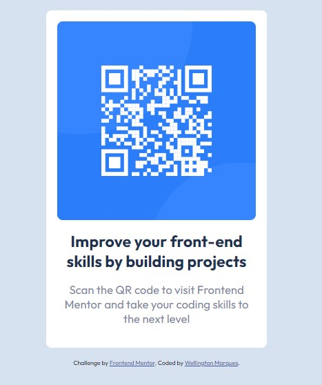

# Frontend Mentor - QR code component solution

This is a solution to the [QR code component challenge on Frontend Mentor](https://www.frontendmentor.io/challenges/qr-code-component-iux_sIO_H). Frontend Mentor challenges help you improve your coding skills by building realistic projects.

## Welcome

## Table of contents

- [Overview](#overview)
  - [Screenshot](#screenshot)
  - [Links](#links)
- [My process](#my-process)
  - [Built with](#built-with)
  - [What I learned](#what-i-learned)
- [Author](#author)

## Overview

### Screenshot

### Links

- Solution URL: [solution URL](https://www.frontendmentor.io/solutions/qr-code-component-qMVee6uQlN)
- Live Site URL: [site at Github](https://wellingtonmarques96.github.io/qrcodementor.io/)

## My process

### Built with

- Semantic HTML5 markup
- CSS custom properties
- Flexbox
- CSS Grid
- Responsive Layouts

### What I learned

Through this project I've improved my responsive skills, beyond practiced CSS Grid and Flexbox.

## Author

- Github - [WellingtonMarques96](https://github.com/WellingtonMarques96)
- Frontend Mentor - [@WellingtonMarques96](https://www.frontendmentor.io/profile/WellingtonMarques96)
- Linkedin - [@wellington-marques-504514156](https://www.linkedin.com/in/wellington-marques-504514156/)
